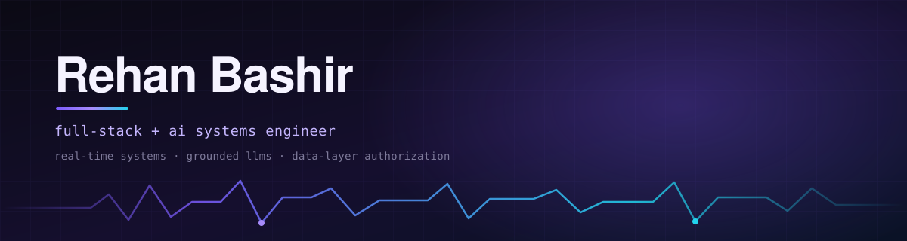

<div align="center">



<br/><br/>

<a href="https://rehanbr.com"></a>
<a href="https://thedeveloperguys.com"></a>
<a href="https://www.linkedin.com/in/rehanbr"></a>
<a href="mailto:rbashir2001@gmail.com"></a>

</div>

<br/>

> Most of what I ship can't afford to be wrong — clinical records, real
> inventory, real money. So the rule gets enforced by the **database**, not by a
> component that might forget to check. The rest of the time I build stranger
> things: a race engineer that only speaks when something actually changed, a
> recommender that has to beat a model allowed to lose.

<br/>

## ⬢ Systems

<table>
<tr>
<td width="50%" valign="top">

**🏎️ F1 25 Race Engineer** &nbsp;·&nbsp; `python` `asyncio`<br/><sub>🟠 testing first proto</sub>

Decodes 16 live UDP telemetry packet types at 20 Hz and talks strategy
over Realtime voice. Eleven stateful "situations" decide when to speak —
onset, real change, resolution. Never a timer.

</td>
<td width="50%" valign="top">

**🏥 ClinicOS** &nbsp;·&nbsp; `next.js` `postgres`<br/><sub>🟠 private build</sub>

Clinic software where Row Level Security *is* the authorization boundary.
Reception can't read notes, doctors can't see billing — the database says
so, not the UI.

</td>
</tr>
<tr>
<td width="50%" valign="top">

**💊 VitaCommerce** &nbsp;·&nbsp; `prisma` `expo`<br/><sub>🟠 private build</sub>

Storefront where checkout is the easy part. Inventory tracked lot by lot,
allocated first-expired-first-out, every movement traceable to its batch.

</td>
<td width="50%" valign="top">

**🎧 Music Taste Engine** &nbsp;·&nbsp; `pytorch` `MERT/CLAP`<br/><sub>🟠 prototyping</sub>

Learns taste from audio embeddings, not genre tags. Three competing models,
one leak-free harness honest enough to let the fancy one lose.

</td>
</tr>
</table>

<details>
<summary><b>&nbsp;⬡ &nbsp;Changelog — smaller things, actually finished</b></summary>

<br/>

| | |
|---|---|
| [**sigil**](https://github.com/rehan-br/sigil) | trace a constellation, an LLM writes back its myth, permanent URL |
| [**watcher**](https://github.com/rehan-br/watcher) | you pick a word, an LLM plays twenty questions, reasoning rendered live |
| [**liars-wordle**](https://github.com/rehan-br/liars-wordle) | the tile colors lie to you, on a hidden schedule |
| [**webcam-draw**](https://github.com/rehan-br/Webcam-Drawing-App) | sketch in the air, pose inference entirely client-side |
| [**buckshot-rl**](https://github.com/rehan-br/buckshot-roulette) | a PPO agent bounded by an exact solver, not just vibes |
| [**f1-telemetry-decoder**](https://github.com/rehan-br/f1-25-telemetry-decoder) | the decoder above, standalone and dependency-free |

</details>

<br/>

## ⬢ The Developer Guys

<table>
<tr>
<td width="130" align="center">

</td>
<td>

### *"We build apps that move you forward."*

A studio, not a solo act. Web apps, APIs, and AI agents that do real work —
built by people who stick around after the invoice clears.

[**thedeveloperguys.com**](https://thedeveloperguys.com) &nbsp;→&nbsp; [hello@thedeveloperguys.com](mailto:hello@thedeveloperguys.com)

</td>
</tr>
</table>

<br/>

## ⬢ Stack

<div align="center">

&nbsp;&nbsp;
&nbsp;&nbsp;
&nbsp;&nbsp;
&nbsp;&nbsp;
&nbsp;&nbsp;
&nbsp;&nbsp;
&nbsp;&nbsp;


&nbsp;&nbsp;
&nbsp;&nbsp;
&nbsp;&nbsp;
&nbsp;&nbsp;
&nbsp;&nbsp;
&nbsp;&nbsp;
&nbsp;&nbsp;


</div>

<br/>

## ⬢ Invariants

```python
assert authority.lives_in(database)             # not ui.hidden_button
assert model.output <= tool_call_results        # no invented facts
assert eval_harness.can_report_negative()       # or it isn't an eval
assert shipped(small_thing) > planned(big_thing)
```

<br/>

<div align="center">


<br/><br/>

<sub>open to interesting problems · always listening on this channel</sub>

</div>
